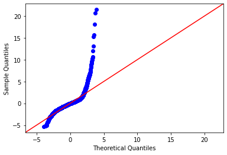
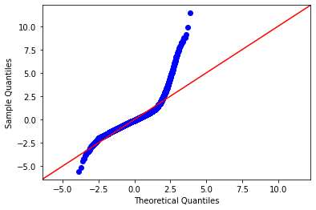
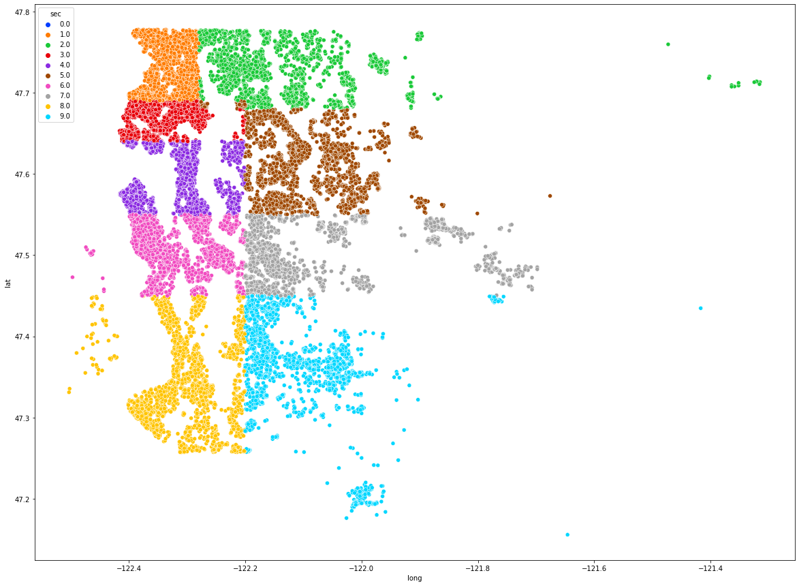
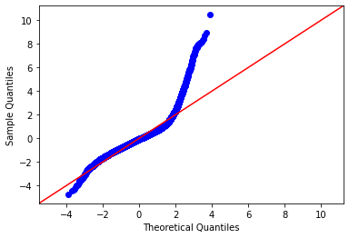

# Readme

### Summary

I will create a model that  evaluates a house’s characteristics that affect the price in the King County area.  

### Data

The data received is a data frame of characteristics about each house. Each characteristic is categorical or continuous data.  

Categorical Data 
 - Date the house was sold
 - Number of bedrooms
 - Number of bathroom
 - Number of floors
 - Having a waterfront
 - If the house has been viewed
 - The house condition
 - The overall grade of the house
 - Zipcode

Continuous Data
 - Price of the house
 - Square footage of the house
 - Square footage of the lot
 - Square footage of the house apart front he basement
 - Square footage of the basement
 - Square footage  living space of the  nearest 15 neighbors
 - Square footage land  of the nearest 15 neighbors

### Data Cleaning: Baseline Model

Clean data to fix missing values,  delete duplicates, and replacing date with the house’s month sold. 

The baseline model shows our initial accuracy of the model, and compare adjusted models to it. It  shows an intercept of 223800 and an r-squared of 0.692.

This graph represents the accuracy of the models ability to predict final price.

### Filtering Data: Model 1

This model will be adjusted for outliers that can be extraneous info to accurately form a model. 

Filtered columns:
 - Bedrooms less than or equal to 7
 - Bathrooms between 1 and 5
 - Squarefoot lot less than 25,0000
 - Squarefoot above basement less than 4,000
 - Squarefoot basement less than 1,500
 - Squarefoot lot of 15 nearest houses, less than 60,000
 - Floors less than or equal to 3
 - Grade between 4 and 11

Intercept is -4248000, R-squared is 0.664. Even though accuracy of the model has decresed, removing outliers in the data will help make more logical conclusions about the final model. 

This graph represents the accuracy of the models ability to predict final price.

### Categorical Variables: Model 2 

For this model, taking into account the categorical variables. Each categorical variable is separated to represent a more detailed model for house attributes that affect the price. 

The intercept is at -8305000, and r-squared is .637. Though the accruacy for the model has decresed, this maybe due to each category being closely coorrelated. The model shows how each category effect the price increasing or decreasing the value of the house. An increase in bedrooms lead to a decrease in value while more bathrooms, a higher grade, and additional floors show an increase in value.

This graph represents the accuracy of the models ability to predict final price.

### Geographic Sectors :Model 3

This model will separate the map into geographic sectors to show a difference in price depending on location. 

The intercept is 44,550,000, and r-squared .721. Here can see the price effects between each sector. Sector 4 shows the largest increase while sector 2 shows a decrease in price. 

This graph represents the accuracy of the models ability to predict final price.

### Multicollinearity: Model 4

This model will adjust for multicollinearity in order to account for high p-values. Droppped variables include:
 - Zipcode
 - Latitude
 - Longitude
 - Square footage above the basement
 - Square footage lot of nearest 15 houses
 - Dedrooms 2-4
 - Bathrooms 2-3
 - Grade 5-7
 - Sector 6

This model shows an intercept of 1,268,000 and r-squared .709. Removing unnecessary and multi-colinear variables takes away from the models ability to generalize for all the houses. Although, without unnecessary and multi-colinear variables, the model has less interference between each variable, increasing variables independence to make a more sound model for predicting price. 

This graph represents the accuracy of the models ability to predict final price.

## Conclusion

The final model is more limited predicting price than previous models since there are some variables  removed, but its predictions are more plausible with removing multicollinearity indicators.  With p-values < .01, each variable is independently able to predict the final price.
